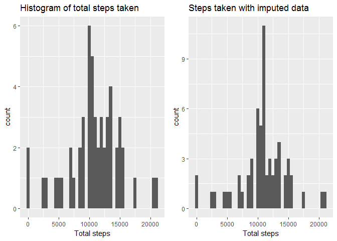

## Loading and preprocessing the data
### Load the data (i.e. \color{red}{\verb|read.csv()|}read.csv())


The activity.zip file is located in the repository. The file activity.csv is loaded without unzipping.


```r
library(tidyverse)
library(knitr)

# List files in .zip
unzip("activity.zip", list=TRUE)
```

```
##           Name Length                Date
## 1 activity.csv 350829 2014-02-11 10:08:00
```

```r
# load .csv
data.raw <-read.table(unz("activity.zip", "activity.csv"), sep = ",", header = TRUE)
```

### Process/transform the data (if necessary) into a format suitable for your analysis

Exploring the data reveals the following

```r
str(data.raw)
```

```
## 'data.frame':	17568 obs. of  3 variables:
##  $ steps   : int  NA NA NA NA NA NA NA NA NA NA ...
##  $ date    : Factor w/ 61 levels "2012-10-01","2012-10-02",..: 1 1 1 1 1 1 1 1 1 1 ...
##  $ interval: int  0 5 10 15 20 25 30 35 40 45 ...
```

Where the variables included in this dataset are:

**steps:** Number of steps taking in a 5-minute interval (missing values are coded as \color{red}{\verb|NA|}NA)  
**date:** The date on which the measurement was taken in YYYY-MM-DD format  
**interval:** Identifier for the 5-minute interval in which measurement was taken  
  
The date variable is turned into a date insted of factor.

```r
data.raw$date <- as.Date(data.raw$date)
str(data.raw)
```

```
## 'data.frame':	17568 obs. of  3 variables:
##  $ steps   : int  NA NA NA NA NA NA NA NA NA NA ...
##  $ date    : Date, format: "2012-10-01" "2012-10-01" ...
##  $ interval: int  0 5 10 15 20 25 30 35 40 45 ...
```

## What is mean total number of steps taken per day?
For this part of the assignment, you can ignore the missing values in the dataset.

### Calculate the total number of steps taken per day

```r
data.naomit <- na.omit(data.raw)

total.steps <- data.naomit %>% group_by(date) %>% summarise(total_steps = sum(steps))
kable(total.steps, format = "html")
```

<table>
 <thead>
  <tr>
   <th style="text-align:left;"> date </th>
   <th style="text-align:right;"> total_steps </th>
  </tr>
 </thead>
<tbody>
  <tr>
   <td style="text-align:left;"> 2012-10-02 </td>
   <td style="text-align:right;"> 126 </td>
  </tr>
  <tr>
   <td style="text-align:left;"> 2012-10-03 </td>
   <td style="text-align:right;"> 11352 </td>
  </tr>
  <tr>
   <td style="text-align:left;"> 2012-10-04 </td>
   <td style="text-align:right;"> 12116 </td>
  </tr>
  <tr>
   <td style="text-align:left;"> 2012-10-05 </td>
   <td style="text-align:right;"> 13294 </td>
  </tr>
  <tr>
   <td style="text-align:left;"> 2012-10-06 </td>
   <td style="text-align:right;"> 15420 </td>
  </tr>
  <tr>
   <td style="text-align:left;"> 2012-10-07 </td>
   <td style="text-align:right;"> 11015 </td>
  </tr>
  <tr>
   <td style="text-align:left;"> 2012-10-09 </td>
   <td style="text-align:right;"> 12811 </td>
  </tr>
  <tr>
   <td style="text-align:left;"> 2012-10-10 </td>
   <td style="text-align:right;"> 9900 </td>
  </tr>
  <tr>
   <td style="text-align:left;"> 2012-10-11 </td>
   <td style="text-align:right;"> 10304 </td>
  </tr>
  <tr>
   <td style="text-align:left;"> 2012-10-12 </td>
   <td style="text-align:right;"> 17382 </td>
  </tr>
  <tr>
   <td style="text-align:left;"> 2012-10-13 </td>
   <td style="text-align:right;"> 12426 </td>
  </tr>
  <tr>
   <td style="text-align:left;"> 2012-10-14 </td>
   <td style="text-align:right;"> 15098 </td>
  </tr>
  <tr>
   <td style="text-align:left;"> 2012-10-15 </td>
   <td style="text-align:right;"> 10139 </td>
  </tr>
  <tr>
   <td style="text-align:left;"> 2012-10-16 </td>
   <td style="text-align:right;"> 15084 </td>
  </tr>
  <tr>
   <td style="text-align:left;"> 2012-10-17 </td>
   <td style="text-align:right;"> 13452 </td>
  </tr>
  <tr>
   <td style="text-align:left;"> 2012-10-18 </td>
   <td style="text-align:right;"> 10056 </td>
  </tr>
  <tr>
   <td style="text-align:left;"> 2012-10-19 </td>
   <td style="text-align:right;"> 11829 </td>
  </tr>
  <tr>
   <td style="text-align:left;"> 2012-10-20 </td>
   <td style="text-align:right;"> 10395 </td>
  </tr>
  <tr>
   <td style="text-align:left;"> 2012-10-21 </td>
   <td style="text-align:right;"> 8821 </td>
  </tr>
  <tr>
   <td style="text-align:left;"> 2012-10-22 </td>
   <td style="text-align:right;"> 13460 </td>
  </tr>
  <tr>
   <td style="text-align:left;"> 2012-10-23 </td>
   <td style="text-align:right;"> 8918 </td>
  </tr>
  <tr>
   <td style="text-align:left;"> 2012-10-24 </td>
   <td style="text-align:right;"> 8355 </td>
  </tr>
  <tr>
   <td style="text-align:left;"> 2012-10-25 </td>
   <td style="text-align:right;"> 2492 </td>
  </tr>
  <tr>
   <td style="text-align:left;"> 2012-10-26 </td>
   <td style="text-align:right;"> 6778 </td>
  </tr>
  <tr>
   <td style="text-align:left;"> 2012-10-27 </td>
   <td style="text-align:right;"> 10119 </td>
  </tr>
  <tr>
   <td style="text-align:left;"> 2012-10-28 </td>
   <td style="text-align:right;"> 11458 </td>
  </tr>
  <tr>
   <td style="text-align:left;"> 2012-10-29 </td>
   <td style="text-align:right;"> 5018 </td>
  </tr>
  <tr>
   <td style="text-align:left;"> 2012-10-30 </td>
   <td style="text-align:right;"> 9819 </td>
  </tr>
  <tr>
   <td style="text-align:left;"> 2012-10-31 </td>
   <td style="text-align:right;"> 15414 </td>
  </tr>
  <tr>
   <td style="text-align:left;"> 2012-11-02 </td>
   <td style="text-align:right;"> 10600 </td>
  </tr>
  <tr>
   <td style="text-align:left;"> 2012-11-03 </td>
   <td style="text-align:right;"> 10571 </td>
  </tr>
  <tr>
   <td style="text-align:left;"> 2012-11-05 </td>
   <td style="text-align:right;"> 10439 </td>
  </tr>
  <tr>
   <td style="text-align:left;"> 2012-11-06 </td>
   <td style="text-align:right;"> 8334 </td>
  </tr>
  <tr>
   <td style="text-align:left;"> 2012-11-07 </td>
   <td style="text-align:right;"> 12883 </td>
  </tr>
  <tr>
   <td style="text-align:left;"> 2012-11-08 </td>
   <td style="text-align:right;"> 3219 </td>
  </tr>
  <tr>
   <td style="text-align:left;"> 2012-11-11 </td>
   <td style="text-align:right;"> 12608 </td>
  </tr>
  <tr>
   <td style="text-align:left;"> 2012-11-12 </td>
   <td style="text-align:right;"> 10765 </td>
  </tr>
  <tr>
   <td style="text-align:left;"> 2012-11-13 </td>
   <td style="text-align:right;"> 7336 </td>
  </tr>
  <tr>
   <td style="text-align:left;"> 2012-11-15 </td>
   <td style="text-align:right;"> 41 </td>
  </tr>
  <tr>
   <td style="text-align:left;"> 2012-11-16 </td>
   <td style="text-align:right;"> 5441 </td>
  </tr>
  <tr>
   <td style="text-align:left;"> 2012-11-17 </td>
   <td style="text-align:right;"> 14339 </td>
  </tr>
  <tr>
   <td style="text-align:left;"> 2012-11-18 </td>
   <td style="text-align:right;"> 15110 </td>
  </tr>
  <tr>
   <td style="text-align:left;"> 2012-11-19 </td>
   <td style="text-align:right;"> 8841 </td>
  </tr>
  <tr>
   <td style="text-align:left;"> 2012-11-20 </td>
   <td style="text-align:right;"> 4472 </td>
  </tr>
  <tr>
   <td style="text-align:left;"> 2012-11-21 </td>
   <td style="text-align:right;"> 12787 </td>
  </tr>
  <tr>
   <td style="text-align:left;"> 2012-11-22 </td>
   <td style="text-align:right;"> 20427 </td>
  </tr>
  <tr>
   <td style="text-align:left;"> 2012-11-23 </td>
   <td style="text-align:right;"> 21194 </td>
  </tr>
  <tr>
   <td style="text-align:left;"> 2012-11-24 </td>
   <td style="text-align:right;"> 14478 </td>
  </tr>
  <tr>
   <td style="text-align:left;"> 2012-11-25 </td>
   <td style="text-align:right;"> 11834 </td>
  </tr>
  <tr>
   <td style="text-align:left;"> 2012-11-26 </td>
   <td style="text-align:right;"> 11162 </td>
  </tr>
  <tr>
   <td style="text-align:left;"> 2012-11-27 </td>
   <td style="text-align:right;"> 13646 </td>
  </tr>
  <tr>
   <td style="text-align:left;"> 2012-11-28 </td>
   <td style="text-align:right;"> 10183 </td>
  </tr>
  <tr>
   <td style="text-align:left;"> 2012-11-29 </td>
   <td style="text-align:right;"> 7047 </td>
  </tr>
</tbody>
</table>


### If you do not understand the difference between a histogram and a barplot, research the difference between them. Make a histogram of the total number of steps taken each day


```r
gg <- ggplot(total.steps)+
        geom_histogram(aes(total_steps), binwidth = 500)+
        ggtitle("Histogram of total steps taken")+
        xlab("Total steps")
gg
```

<!-- -->


### Calculate and report the mean and median of the total number of steps taken per day
The mean is 1.0765\times 10^{4} and the median is 8841


```r
summary(total.steps$total_steps)
```

```
##    Min. 1st Qu.  Median    Mean 3rd Qu.    Max. 
##      41    8841   10765   10766   13294   21194
```


## What is the average daily activity pattern?

##Make a time series plot (i.e. \color{red}{\verb|type = "l"|}type="l") of the 5-minute interval (x-axis) and the average number of steps taken, averaged across all days (y-axis)


```r
intervals <- data.naomit %>% group_by(interval) %>% summarise(mean = mean(steps))

ggplot(intervals)+
        geom_line(aes(x=interval, y = mean))+
        ggtitle("5-minute intervals vs. mean amount of steps across days")
```

<!-- -->


##Which 5-minute interval, on average across all the days in the dataset, contains the maximum number of steps?

```r
intervals %>% top_n(1, mean)
```

```
## # A tibble: 1 x 2
##   interval     mean
##      <int>    <dbl>
## 1      835 206.1698
```


## Imputing missing values
Note that there are a number of days/intervals where there are missing values (coded as \color{red}{\verb|NA|}NA). The presence of missing days may introduce bias into some calculations or summaries of the data.

## Calculate and report the total number of missing values in the dataset (i.e. the total number of rows with \color{red}{\verb|NA|}NAs)
There are several ways to do this. I choose to create a column with the number of NA's for each row. I can then summarise the number of rows with one or more NA's.

```r
data.raw$row_nas <- rowSums(is.na(data.raw))
head(data.raw)
```

```
##   steps       date interval row_nas
## 1    NA 2012-10-01        0       1
## 2    NA 2012-10-01        5       1
## 3    NA 2012-10-01       10       1
## 4    NA 2012-10-01       15       1
## 5    NA 2012-10-01       20       1
## 6    NA 2012-10-01       25       1
```

```r
(n_nas <- data.raw %>% group_by(row_nas) %>% summarise(n_rows = n()))
```

```
## # A tibble: 2 x 2
##   row_nas n_rows
##     <dbl>  <int>
## 1       0  15264
## 2       1   2304
```
There are 2304 rows with NA's.

## Devise a strategy for filling in all of the missing values in the dataset. The strategy does not need to be sophisticated. For example, you could use the mean/median for that day, or the mean for that 5-minute interval, etc.


```r
# create column with mean for 5-minute interval
data.imp <- inner_join(data.raw, intervals)
```

```
## Joining, by = "interval"
```

```r
head(data.imp)
```

```
##   steps       date interval row_nas      mean
## 1    NA 2012-10-01        0       1 1.7169811
## 2    NA 2012-10-01        5       1 0.3396226
## 3    NA 2012-10-01       10       1 0.1320755
## 4    NA 2012-10-01       15       1 0.1509434
## 5    NA 2012-10-01       20       1 0.0754717
## 6    NA 2012-10-01       25       1 2.0943396
```

```r
# impute NA with the mean for 5-minute interval
data.imp$steps[is.na(data.imp$steps)] <- data.imp$mean[is.na(data.imp$steps)]
head(data.imp)
```

```
##       steps       date interval row_nas      mean
## 1 1.7169811 2012-10-01        0       1 1.7169811
## 2 0.3396226 2012-10-01        5       1 0.3396226
## 3 0.1320755 2012-10-01       10       1 0.1320755
## 4 0.1509434 2012-10-01       15       1 0.1509434
## 5 0.0754717 2012-10-01       20       1 0.0754717
## 6 2.0943396 2012-10-01       25       1 2.0943396
```

```r
# remove temporary columns
data.imp <- data.imp[,1:3]

# tjek if there is any NA's
sum(is.na(data.imp))
```

```
## [1] 0
```


## Create a new dataset that is equal to the original dataset but with the missing data filled in.
This is the data.imp data set.


```r
head(data.imp)
```

```
##       steps       date interval
## 1 1.7169811 2012-10-01        0
## 2 0.3396226 2012-10-01        5
## 3 0.1320755 2012-10-01       10
## 4 0.1509434 2012-10-01       15
## 5 0.0754717 2012-10-01       20
## 6 2.0943396 2012-10-01       25
```


## Make a histogram of the total number of steps taken each day and Calculate and report the mean and median total number of steps taken per day. Do these values differ from the estimates from the first part of the assignment? What is the impact of imputing missing data on the estimates of the total daily number of steps?

```r
total.steps.imp <- data.imp %>% group_by(date) %>% summarise(total_steps = sum(steps))

gg.imp <- ggplot(total.steps.imp)+
        geom_histogram(aes(total_steps), binwidth = 500)+
        ggtitle("Steps taken with imputed data")+
        xlab("Total steps")


library(gridExtra)
grid.arrange(gg, gg.imp, nrow = 1)
```

<!-- -->

```r
summary(total.steps.imp$total_steps)
```

```
##    Min. 1st Qu.  Median    Mean 3rd Qu.    Max. 
##      41    9819   10766   10766   12811   21194
```

```r
summary(total.steps$total_steps)
```

```
##    Min. 1st Qu.  Median    Mean 3rd Qu.    Max. 
##      41    8841   10765   10766   13294   21194
```
The result is that the distribution gets more narrow arround the mean, however as expectet the mean and median do not change. (actually the median changes by 1). This is expected becouse i used a imputation strategy where NA's was replaced by the mean from that 5-minute window.


## Are there differences in activity patterns between weekdays and weekends?


```r
Sys.setlocale("LC_TIME", "English")
```

```
## [1] "English_United States.1252"
```

```r
table(weekdays(data.imp$date))
```

```
## 
##    Friday    Monday  Saturday    Sunday  Thursday   Tuesday Wednesday 
##      2592      2592      2304      2304      2592      2592      2592
```

```r
data.weekdays <- data.imp %>% filter(weekdays(date) != c("Saturday", "Sunday"))
data.weekends <- data.imp %>% filter(weekdays(date) == c("Saturday", "Sunday"))


total.steps.weekdays <- data.weekdays %>% group_by(date) %>% summarise(total_steps = sum(steps))
total.steps.weekends <- data.weekends %>% group_by(date) %>% summarise(total_steps = sum(steps))

hist.weekdays <- ggplot(total.steps.weekdays)+
        geom_histogram(aes(total_steps), binwidth = 500)+
        ggtitle("Weekdays total steps")+
        xlab("Total steps")
hist.weekends <-  ggplot(total.steps.weekends)+
        geom_histogram(aes(total_steps), binwidth = 500)+
        ggtitle("Weekends total steps")+
        xlab("Total steps")


intervals.weekdays <- data.weekdays %>% group_by(interval) %>% summarise(mean = mean(steps))
intervals.weekends <- data.weekends %>% group_by(interval) %>% summarise(mean = mean(steps))


time.weekdays <- ggplot(intervals.weekdays)+
        geom_line(aes(x=interval, y = mean))+
        ggtitle("Weekdays 5-min interval mean \nsteps across days")
time.weekends <- ggplot(intervals.weekends)+
        geom_line(aes(x = interval, y = mean))+
        ggtitle("Weekends 5-min interval mean \nsteps across days")

grid.arrange(hist.weekdays, hist.weekends, time.weekdays, time.weekends, nrow = 2)
```

<!-- -->

```r
summary(total.steps.weekdays$total_steps)
```

```
##    Min. 1st Qu.  Median    Mean 3rd Qu.    Max. 
##      41    5542    9819    9170   11162   21194
```

```r
summary(total.steps.weekends$total_steps)
```

```
##    Min. 1st Qu.  Median    Mean 3rd Qu.    Max. 
##    4535    5341    5856    6085    6827    7828
```

```r
summary(intervals.weekdays$mean)
```

```
##    Min. 1st Qu.  Median    Mean 3rd Qu.    Max. 
##   0.000   2.053  29.334  36.647  53.459 220.041
```

```r
summary(intervals.weekends$mean)
```

```
##    Min. 1st Qu.  Median    Mean 3rd Qu.    Max. 
##   0.000   1.021  21.400  42.257  70.594 222.639
```

The resulting plots and summries show that on avarage more steps are taken during weekdays, however in weeknds the steps are more evenly distributed across 5-min. intervals.
